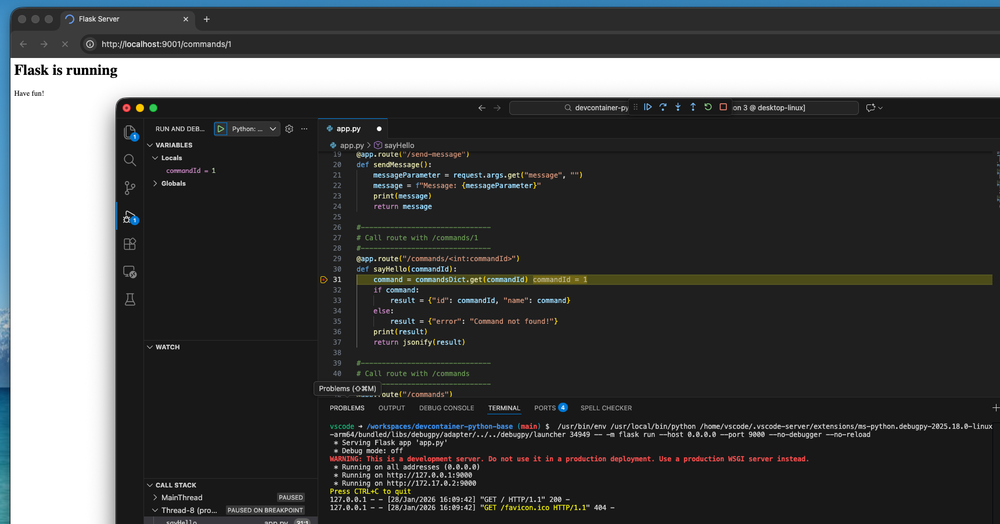

# Devcontainer base setup for python
This repo provides a base setup for dev containers with python.

## Prerequisites
- [Docker Desktop](https://www.docker.com/products/docker-desktop) up and running
- [VS Code](https://code.visualstudio.com/download) with [devcontainers Extension](https://code.visualstudio.com/docs/devcontainers/containers)

## Run
- Open VS Code
- Press F1 and run "Dev Containers: Reopen in Container"
- Connect to Devcontainer
- In the dev container terminal, run either `python app.py` or `python -m flask --app app run --debug`
- To run the standalone sum script, use `python sum_numbers.py` (or `python3 sum_numbers.py` if `python` is unavailable)
- 
